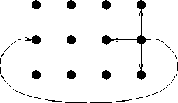

# MPI Cart Communicatior

The MPI Cart Communicator allows to simply setup a cartesian mesh as a communication.

The required function is called `MPI_Cart_create` and the parameters are defined [here](https://www.mpich.org/static/docs/latest/www3/MPI_Cart_create.html). The following definition should not replace the official documentation, it should just give a small extension.

For a cartesian communicator you need to define:

- a new variable for the new communicator
- the dimensions (`ndims`) e.g. 2 for 2D or 3 for 3D
- the number of processes in each dimension `dims`
- whether the grid is periodic or not
- whether the ranks should be reordered, if this set to `true` the ranks of the `MPI_COMM_WORLD` don't match any more with the new ranks in the `MPI_Cart` communicator

## Quote from the [MPI Standard](https://www.mpi-forum.org/docs/mpi-3.1/mpi31-report.pdf) regarding the dimensions

> MPI_CART_CREATE can be used to describe Cartesian structures of arbitrary dimension. For each coordinate direction one specifies     whether the process structure is periodic or not. Note that an n-dimensional hypercube is an n-dimensional torus with 2 processes per
coordinate direction.

!!! info
    Therefore it's important to note that there is **no** default x or y direction, this also yields that if you perform research regarding this topic you might encounter different layouts. Therefore you should pay attention to the variable `dims`.

## Periodic Grid

A period grid looks can be imagined like this:

This might be beneficial for periodic stencils as the name implies.

## Example Initialization 

If we initialize our Domain with:

- `iproc = 2`
- `jproc = 2`
- `const int dims[2] = {2, 2};` (Definition in the function call `MPI_CARTE_Create`)

the ranks are organized as follows (the table should represent the domain and each cell a subdomain), the parentheses show the coordinates (_coords_).

|              |              |
|--------------|--------------|
| Rank 0 (0,0) | Rank 2 (1,0) |
| Rank 1 (0,1) | Rank 3 (1,1) |

if we increase the number of MPI processes into the _x-direction_[^1] we get the following table:

- `iproc = 3`
- `jproc = 2`
- `const int dims[2] = {3, 2};` (Definition in the function call `MPI_CARTE_Create`)

|              |              |               |
|--------------|--------------|---------------|
| Rank 0 (0,0) | Rank 2 (1,0) | Rank 4 (2,0)  |
| Rank 1 (0,1) | Rank 3 (1,1) | Rank 5 (2,1) |

[^1]: As already mentioned there is no per se topology mapping, this examples assumes that the number of MPI processes is define in the first array position of the function argument `const int dims`. 

