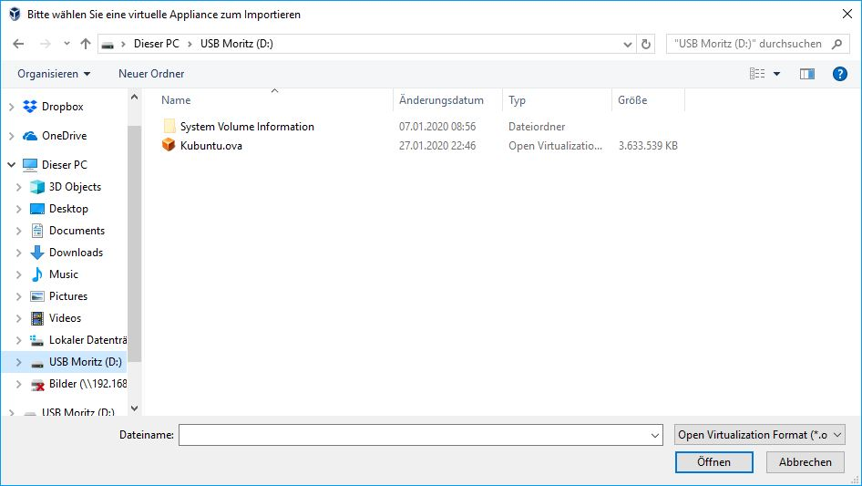

# 1. Development Environment Setup

## Setup VirtualBox

[VirtualBox](https://www.virtualbox.org/) is a virtualization software which allows to easily create and install Virtual Machines on your Laptop/Desktop PC. This is epically useful if you don't have a Linux installation and would prefer to have a sandboxed system. However, expect significant performance drop compared to a dedicated installation. If you can get everything installed on your native system, you can completely ignore this page.

To start working with VirtualBox you have to [download](https://www.virtualbox.org/wiki/Downloads) the latest version and install it.

Steps:

1. Download the latest Version of VirtualBox: [link](https://www.virtualbox.org/wiki/Downloads)
2. Install VirtualBox

## Setup of the Virtual Machine (VM)

The default setup procedure for a new machine is normally as follows: 

1. Download the ISO image for your desired operating system
2. Create a new VM in VirtualBox 
3. Load the ISO image when you start the VM for the first time
4. Follow the installtion instructions of the OS
5. Install required software
6. Configure your keyboard layout (if needed), under `System Settings > Input Devices > Keyboard > Layouts > Add`

We already prepared a [CFD Lab virtual machine image](https://syncandshare.lrz.de/getlink/fi58r3fFtokHSYnC2BbeKT37/Kubuntu.ova) for you which can be loaded into VirtualBox. This image contains all the required software and can be seen as _Plug-and-play_ - Setup. The image is based on [Kubuntu](https://kubuntu.org/getkubuntu/) 20.04 (Long-term-support), which is lightweight and looks similar to Windows. The following software is preinstalled:

- Paraview and VTK
- Python3
- g++
- git
- mpi
- make
- cmake
- VSCode
- Atom

The password of the user is `cfd` and the user has `sudo` rights.

### Importing and configuring the prepared image

1. Open VirtualBox and open the import dialog (this can be also done with the shortcut): `CMD+I` / `STRG+I`

    {: style="display: block;margin-left: auto;margin-right: auto;width: 50%;box-shadow: 0 4px 8px 0 rgba(0, 0, 0, 0.2), 0 6px 20px 0 rgba(0, 0, 0, 0.19);"}    

1. Select the downloaded image

    {: style="display: block;margin-left: auto;margin-right: auto;width: 50%;box-shadow: 0 4px 8px 0 rgba(0, 0, 0, 0.2), 0 6px 20px 0 rgba(0, 0, 0, 0.19);"}    

1. Set the RAM for the VM, in this case it's 4096 MB, you can choose of course another value (preferably more than 2GB). Similarly, you may also want to increase the `Video Memory`, which you can find under `Display` (not shown here). Click `Import`/`Importieren` and the importing procedure will start.

    {: style="display: block;margin-left: auto;margin-right: auto;width: 50%;box-shadow: 0 4px 8px 0 rgba(0, 0, 0, 0.2), 0 6px 20px 0 rgba(0, 0, 0, 0.19);"}    

    {: style="display: block;margin-left: auto;margin-right: auto;width: 50%;box-shadow: 0 4px 8px 0 rgba(0, 0, 0, 0.2), 0 6px 20px 0 rgba(0, 0, 0, 0.19);"}    

1. Once the importing is finished (it might take a while) you can start the VM using the green arrow ("play") and the `Kubuntu` start screen should appear.

    {: style="display: block;margin-left: auto;margin-right: auto;width: 50%;box-shadow: 0 4px 8px 0 rgba(0, 0, 0, 0.2), 0 6px 20px 0 rgba(0, 0, 0, 0.19);"}    

