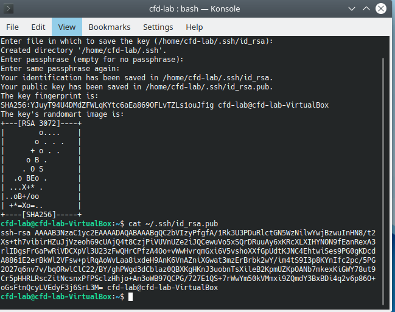
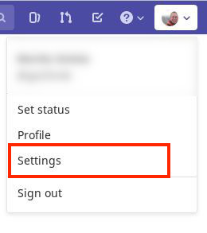
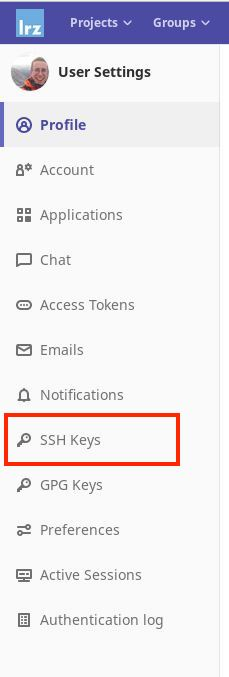
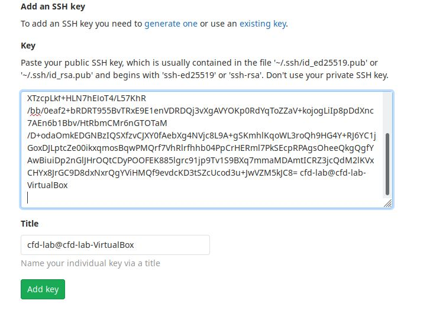
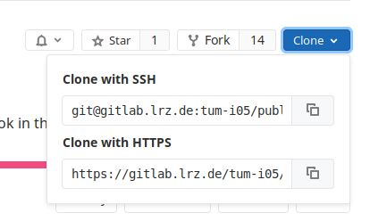
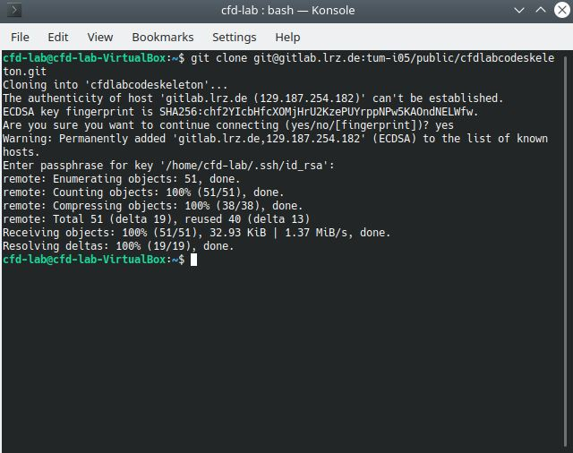

# 2. GIT Introduction

The version control system `git` is probably the most used tool to work with code and keep track of the different changes while you develop your code. [Gitlab](http://gitlab.com/) or [Github](http://github.com/) are well known web applications to visualize the changes and work with code in a team manner. For example one of your team members has developed a feature and you would like to merge it into your main development branch, this can be done easily on Gitlab with Merge Requests. Here at TUM we also have [our own Gitlab instance, hosted by the LRZ](https://gitlab.lrz.de/). You can login with your default TUM credentials.

## Preparation

One important aspect for working with Gitlab is that you have to authenticate yourself with it otherwise you are not able to clone or push code to gitlab. This depends on the type of protocol you choose to get the remote content into your computer: HTTPS, or SSH. The first approach requires that you enter your TUM credentials for the authentication, the second approach requires an `ssh`-key which can be quickly generated (only needed once). We will use the latter approach, as it is more convenient and secure.

This is a summary of the steps described in the [GitLab documentation](https://docs.gitlab.com/ee/ssh/).

1. Open the terminal/console and enter `sshkey-gen`.
2. You will be asked where you would like to place the ssh-key, you can take the default case by hitting `enter`.
3. Enter a passphrase for you ssh-key, this is a second security feature and good practice.
4. To output the public part of you ssh-key, enter `cat ~/.ssh/is_rsa.pub`. The sequences of the commands can be seen in the following picture.

    {: style="display: block;margin-left: auto;margin-right: auto;width: 50%;box-shadow: 0 4px 8px 0 rgba(0, 0, 0, 0.2), 0 6px 20px 0 rgba(0, 0, 0, 0.19);"}  

5. Copy the output of the previous command to your clipboard.
6. Open [Gitlab LRZ](https://gitlab.lrz.de) and login in to your account.
7. Navigate to the settings of your account (top right corner)

    {: style="height:100px;display: block;margin-left: auto;margin-right: auto;box-shadow: 0 4px 8px 0 rgba(0, 0, 0, 0.2), 0 6px 20px 0 rgba(0, 0, 0, 0.19);"}  

8. Navigate to the `SSH Keys`. 

    {: style="height:200px;display: block;margin-left: auto;margin-right: auto;box-shadow: 0 4px 8px 0 rgba(0, 0, 0, 0.2), 0 6px 20px 0 rgba(0, 0, 0, 0.19);"}  

9. Insert the public key into the appropriate field and click on `Add key`. If you haven't changed your gitlab notifications you'll get an email to your default email address.

    {: style="display: block;margin-left: auto;margin-right: auto;width: 50%;box-shadow: 0 4px 8px 0 rgba(0, 0, 0, 0.2), 0 6px 20px 0 rgba(0, 0, 0, 0.19);"}  

10. Now we have setup the ssh key we can clone repositories from gitlab to our VM.
    1.  Go to the [CFD Code Skeleton](https://gitlab.lrz.de/tum-i05/public/cfdlabcodeskeleton)
    2.  Select the blue `clone` button
    3.  Select the link `clone with ssh`
        {: style="height:100px;display: block;margin-left: auto;margin-right: auto;box-shadow: 0 4px 8px 0 rgba(0, 0, 0, 0.2), 0 6px 20px 0 rgba(0, 0, 0, 0.19);"}  
    1.  Go to the terminal
    2.  Write `git clone` and paste the link
    3.  Hit `enter` and the repository will be cloned 

        {: style="display: block;margin-left: auto;margin-right: auto;width: 50%;box-shadow: 0 4px 8px 0 rgba(0, 0, 0, 0.2), 0 6px 20px 0 rgba(0, 0, 0, 0.19);"}  
