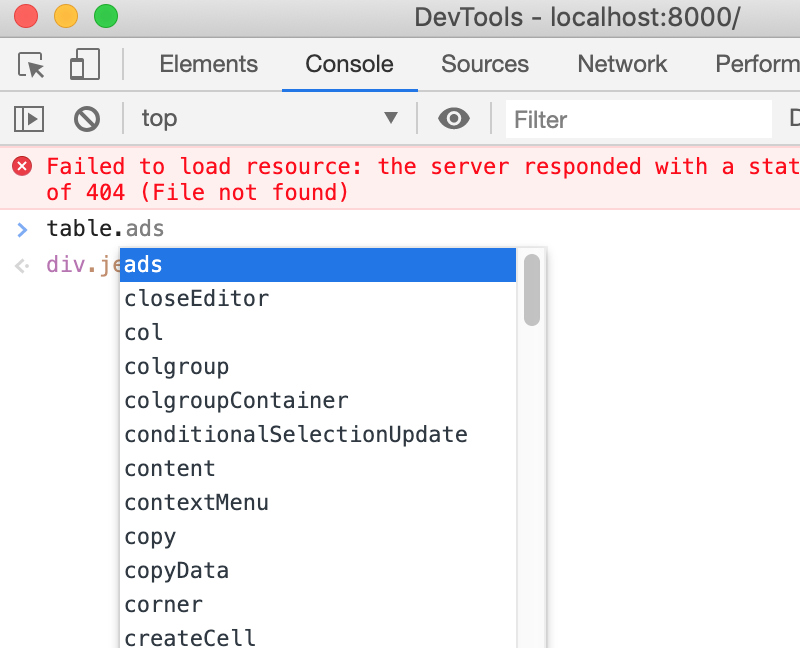

# Debugging / Improvement of the tool

For debugging the provided tool running the application without flask is more beneficial and allows fast iteration steps. 

## Hints for Debugging

### Differentiation Filetype mjs vs Filetype js

When one is writing javascript code in the standard case each file has the extension `.js`. In order to use the `import` functionalities of javascript the ending is changed from `.js` to `.mjs` to clarify this difference. All files that have the filetype `.js` only import functions or objects from the module files, they don't export any.

### Exporting Variables/Objects

To import a function or an object from another javascript file simply, you have to add the keyword `export`

```javascript
// file1.mjs
export function do_something() {
    console.log("Hello World");
}

// file2.mjs
import { do_something } from './file1.mjs';
```

#### Javascript Objects

One scenario for debugging is to use the integrated console of every common browser (e.g. Firefox, Chrome, Brave,...). This is shown in the following graphic:

{: style="height:300px;display: block;margin-left: auto;margin-right: auto;width: 50%;box-shadow: 0 4px 8px 0 rgba(0, 0, 0, 0.2), 0 6px 20px 0 rgba(0, 0, 0, 0.19);"}

If you want to use Javascript objects, such as the object `table` in the console, you can help yourself by using the variable `window`. Then you can work e.g. with the object `table` and call different functions.

```javascript
import { logger } from './modules/logger.mjs';
import { color_dict } from './modules/dicts.mjs';
import { table } from './modules/table.mjs';
// Accessing the variable table
window.table = table;
```
