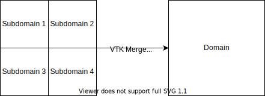
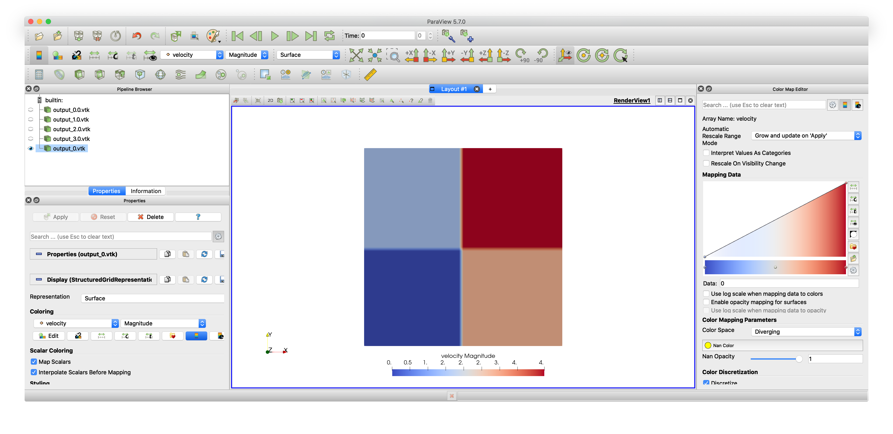

# Overview

The following VTK Tools come along with this repository.

1. Compare - Tool
2. Merge - Tool

The tools are located in the folder `VTK_Tools`.

#### Setup (Ubuntu **20.04**)

```
apt-get update &&
apt-get upgrade -y &&
apt-get install -y build-essential cmake libvtk7-dev libfmt-dev
```

#### Setup (Ubuntu **18.04**)

```
apt-get update &&
apt-get install -y software-properties-common &&
add-apt-repository -y ppa:ubuntu-toolchain-r/test &&
apt-get upgrade -y &&
apt-get install -y build-essential cmake libvtk7-dev libfmt-dev gcc-9 g++-9
apt-get install -y gcc-9 g++-9
```

## Building (Ubuntu **20.04**)

1. `cd tools`
2. `mkdir build && cd build`
3. `cmake .. && make`

Oneliner:

```
cd tools/VTK_Tools && mkdir build && cd build && cmake .. && make
```

## Building (Ubuntu **18.04**)

1. `cd tools`
2. `mkdir build && cd build`
   
3. Definition of the new gcc compiler
    ```
    export CXX=`which g++-9`
    ```
4. `cmake .. && make`

Oneliner:

```
cd tools/VTK_Tools && mkdir build && cd build && export CXX=`which g++-9` && cmake .. && make
```

## Compare Tool 

This tool allows to compare two different sets of VTK files. The origin of this tool is the idea to compare different states of a code and their respective solutions, with one solution considered as reference. This is especially helpful while refactoring the code or performing other improvements.

## Merge Tool

With this tool you can merge VTK files from different subdomains to its original domain. As the following pictures visualizes:



### Example Process 

The following pictures should hold as an example reference and show that there is no difference between the original and the new files. Only in the merged velocity VTK files the difference is visible, the reason is that the velocity vectors are now plotted on the whole domain. In the subdomains they were 

### Pressure VTK Files - for each Domain


### Pressure VTK Files - Merged


### Velocity VTK Files - for each Domain


### Velocity VTK Files - Merged



